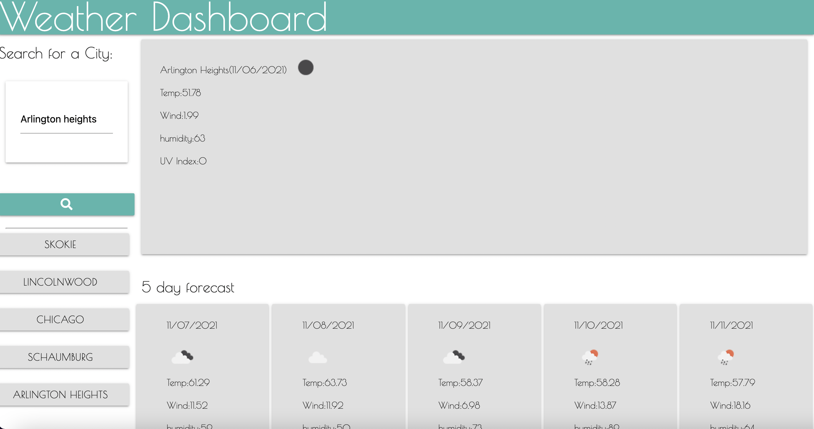

# Weather-Dashboard

## Description
This is a webpage that a traveler could use to navigate the weather of  cities to plan the trip accordingly.  

## Table of Contents

* [Built With](#BuiltWith)
* [Usage](#Usage)
* [Websites](#Websites)
* [Credits](#Credits)

## Built With

1. HTML
2. Materialize CSS
3. JavaScript
4. Moment.js

## Usage

The following image demonstrates the web application's appearance and functionality:

## Websites

https://flowingcityloy.github.io/Weather-Dashboard/ (Links to an external site.)

https://github.com/flowingcityloy/Weather-Dashboard

## Credits

Lydia Loy